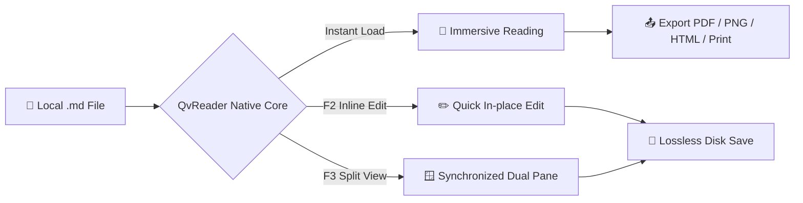
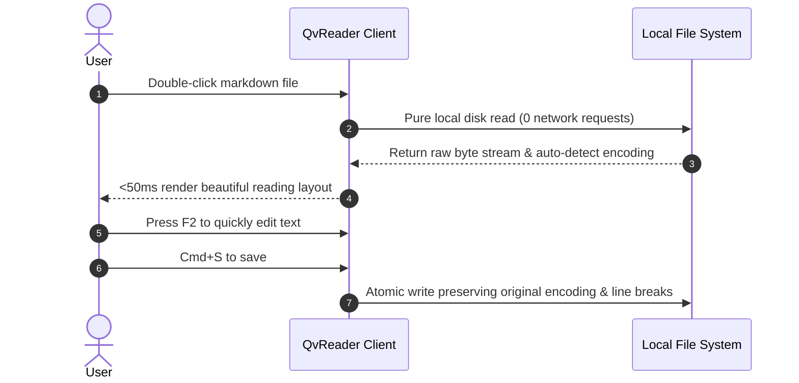

# Welcome to QvReader - Instant Markdown Reader & Editor

Welcome to **QvReader** — the native, distraction-free desktop Markdown viewer & lightweight editor. Launches in `<50ms>` with minimal memory footprint: **double-click to open, read and dismiss instantly, 100% local-first, zero privacy tracking**.

> [!TIP]
> **Quick Tip**: Right-click anywhere in the reading area to open the full context menu; double-click any Mermaid diagram to inspect it in the full-screen zoom modal.

---

## Essential Shortcuts

| Action | macOS Shortcut | Windows / Linux | Description |
| :--- | :--- | :--- | :--- |
| **Pure Reading Mode** | `Cmd + 1` | `Ctrl + 1` | Hide all sidebars and chrome for distraction-free reading |
| **In-place Inline Edit** | `F2` | `F2` | Edit text right where you are reading without losing context |
| **Synchronized Split View** | `F3` | `F3` | Source code on left, synchronized live preview on right |
| **Save Document** | `Cmd + S` | `Ctrl + S` | Save file preserving original line endings & encoding |
| **Toggle Document Outline** | `Cmd + Shift + O` | `Ctrl + Shift + O` | Open table-of-contents drawer and smoothly jump to sections |
| **Standard Print** | `Cmd + P` | `Ctrl + P` | Open system print dialog with optimized pagination (Free) |
| **Export as PDF** | `Cmd + Shift + P` | `Ctrl + Shift + P` | Export document to PDF retaining vector diagrams & math |
| **Export as Image** | `Cmd + Shift + E` | `Ctrl + Shift + E` | Render full document to 2x Retina PNG and copy to clipboard |
| **Export as HTML** | `Cmd + Shift + H` | `Ctrl + Shift + H` | Export self-contained HTML file with embedded styles |
| **Settings Center** | `Cmd + ,` | `Ctrl + ,` | Theme switching, font size zoom, and shortcuts cheat sheet |
| **Fast Exit Window** | `Esc` | `Esc` | Close immediately when there are no unsaved changes |

---

## GFM Checklist & Features

- [x] **Sub-50ms Cold Launch**: Instant start without heavy IDE loading delays
- [x] **Source Fidelity**: Never alters file line endings (CRLF/LF) or encodings (UTF-8/GBK)
- [x] **Engineering Diagrams**: Native Mermaid.js rendering for flowcharts, sequences, and state diagrams
- [x] **LaTeX Math Typesetting**: Sub-millisecond KaTeX engine for inline and block equations
- [x] **100% Local-First**: Offline operation with zero telemetry tracking
- [ ] **Try pressing `F2` or `F3`**: Experience in-place editing or split view right now

---

## Architecture & Diagrams (Mermaid)

QvReader natively parses and renders Mermaid diagrams. **Double-click any diagram** to open the inspection modal with zoom controls (`+`, `-`, 100% reset):



Sequence Diagram Example:



---

## Mathematical Equations (KaTeX)

Render beautiful LaTeX mathematical notation with KaTeX.

Inline equation examples: Mass-energy equivalence $E = mc^2$, Euler's identity $e^{i\pi} + 1 = 0$, and standard deviation $\sigma = \sqrt{\frac{1}{N} \sum_{i=1}^N (x_i - \mu)^2}$.

Gaussian Integral and Discrete Fourier Transform (DFT):

$$
\int_{-\infty}^{\infty} e^{-x^2} dx = \sqrt{\pi}
$$

$$
X_k = \sum_{n=0}^{N-1} x_n \cdot e^{-i 2\pi k n / N}, \quad k = 0, \dots, N-1
$$

Multivariate Normal Distribution:

$$
f(\mathbf{x}) = \frac{1}{(2\pi)^{k/2}|\boldsymbol{\Sigma}|^{1/2}} \exp\left( -\frac{1}{2}(\mathbf{x}-\boldsymbol{\mu})^T \boldsymbol{\Sigma}^{-1} (\mathbf{x}-\boldsymbol{\mu}) \right)
$$

---

## Syntax Highlighting & Code Blocks

Fenced code blocks render with syntax coloring and clean typography:

```rust
// Rust native instant file reading example
use std::fs;
use std::path::Path;

pub fn read_markdown_fast(path: &Path) -> Result<String, std::io::Error> {
    // Pure native zero-overhead byte reading
    fs::read_to_string(path)
}
```

```typescript
// TypeScript session model
export interface DocumentSession {
  filePath: string;
  isDirty: boolean;
  encoding: 'UTF-8' | 'GBK' | 'Shift-JIS';
  lineEnding: 'LF' | 'CRLF';
}
```

---

## Callout Alerts & Quotes

> [!NOTE]
> **Local-First Principle**: All your documents remain strictly on your local computer. QvReader never uploads, scans, or synchronizes your notes.

> [!IMPORTANT]
> **Unsaved Changes Guard**: If you close the window with unsaved edits, a safe exit dialog will always confirm saving so your work is never lost.

> "Simplicity is prerequisite for reliability."  
> Enjoy distraction-free reading and writing with **QvReader**!
