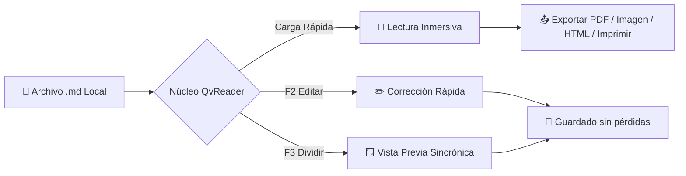

# Bienvenido a QvReader - Lector y Editor Markdown Ultraligero

Bienvenido a **QvReader** —— el visor y editor de Markdown de escritorio nativo, ligero y sin distracciones. Se inicia en `<50ms>` con un consumo mínimo de memoria: **doble clic para abrir, leer y salir al instante, 100% local, cero rastreo de privacidad**.

> [!TIP]
> **Consejo rápido**: Haz clic derecho en cualquier parte del texto para abrir el menú contextual; haz doble clic en cualquier diagrama Mermaid para inspeccionarlo en pantalla completa con zoom.

---

## Atajos de teclado principales

| Acción | Atajo macOS | Windows / Linux | Descripción |
| :--- | :--- | :--- | :--- |
| **Modo Lectura Pura** | `Cmd + 1` | `Ctrl + 1` | Oculta barras laterales para leer sin distracciones |
| **Edición en el lugar** | `F2` | `F2` | Modifica el texto en el mismo lugar sin perder el contexto |
| **Vista dividida sincrónica** | `F3` | `F3` | Código fuente a la izquierda, vista previa en vivo a la derecha |
| **Guardar documento** | `Cmd + S` | `Ctrl + S` | Guarda preservando saltos de línea y codificación original |
| **Esquema de contenido** | `Cmd + Shift + O` | `Ctrl + Shift + O` | Abre el panel de índice para saltar rápidamente a secciones |
| **Imprimir documento** | `Cmd + P` | `Ctrl + P` | Imprime con paginación optimizada (Gratis para siempre) |
| **Exportar como PDF** | `Cmd + Shift + P` | `Ctrl + Shift + P` | Exportación profesional conservando diagramas y fórmulas |
| **Exportar como Imagen** | `Cmd + Shift + E` | `Ctrl + Shift + E` | Renderiza a 2x Retina PNG y copia al portapapeles |
| **Exportar como HTML** | `Cmd + Shift + H` | `Ctrl + Shift + H` | Genera un archivo HTML independiente con estilos integrados |
| **Preferencias y Ajustes** | `Cmd + ,` | `Ctrl + ,` | Cambia temas, tamaño de letra y consulta atajos |
| **Cierre instantáneo** | `Esc` | `Esc` | Cierra la ventana al instante si no hay cambios pendientes |

---

## Lista de tareas GFM y características

- [x] **Inicio rápido en <50ms**: Apertura instantánea sin tiempos de carga pesados
- [x] **Fidelidad Markdown**: Respeta saltos de línea (CRLF/LF) y codificaciones (UTF-8/ISO)
- [x] **Diagramas Mermaid**: Diagramas de flujo, secuencias y estados integrados
- [x] **Fórmulas matemáticas LaTeX**: Motor KaTeX para fórmulas elegantes
- [x] **100% Local y Privado**: Sin servidores remotos ni telemetría oculta
- [ ] **Prueba pulsar `F2` o `F3`**: Comienza a editar o ver en pantalla dividida

---

## Arquitectura y Diagramas (Mermaid)

QvReader soporta diagramas Mermaid. **Haz doble clic en cualquier diagrama** para abrir el modal de inspección con zoom:



---

## Fórmulas matemáticas (KaTeX)

Equivalencia masa-energía $E = mc^2$, identidad de Euler $e^{i\pi} + 1 = 0$.

Integral gaussiana y transformada de Fourier (DFT):

$$
\int_{-\infty}^{\infty} e^{-x^2} dx = \sqrt{\pi}
$$

$$
X_k = \sum_{n=0}^{N-1} x_n \cdot e^{-i 2\pi k n / N}, \quad k = 0, \dots, N-1
$$

---

## Resaltado de sintaxis

```rust
// Lectura de archivo rápida en Rust
use std::fs;
use std::path::Path;

pub fn read_markdown_fast(path: &Path) -> Result<String, std::io::Error> {
    fs::read_to_string(path)
}
```

---

## Avisos y citas

> [!NOTE]
> **Privacidad total**: Todos tus documentos permanecen únicamente en tu dispositivo. QvReader jamás sube tus archivos a la nube.

> [!IMPORTANT]
> **Seguridad de edición**: Si cierras la ventana con cambios sin guardar, aparecerá un diálogo de confirmación para proteger tu trabajo.

¡Disfruta de una lectura y escritura fluida con **QvReader**!
