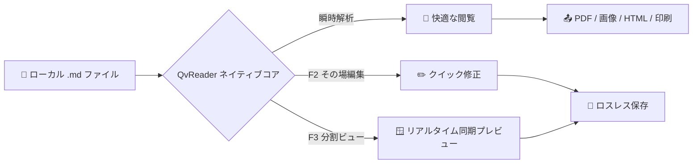

# QvReader へようこそ - 超軽量 Markdown リーダー＆エディタ

**QvReader** へようこそ —— 瞬時の閲覧、集中できる読書、そして軽快な編集のために作られたネイティブデスクトップ Markdown ツールです。起動時間 `<50ms`、超低メモリ消費、**ダブルクリックですぐ開き、読み終えたら即座に終了、100% ローカル完結、プライバシー追跡ゼロ**を実現します。

> [!TIP]
> **便利な機能**：閲覧領域の任意の場所で右クリックすると、フル機能のコンテキストメニューが表示されます。Mermaid 図をダブルクリックすると拡大縮小モーダルで詳しく確認できます。

---

## 主なショートカット一覧

| 操作 | macOS | Windows / Linux | 説明 |
| :--- | :--- | :--- | :--- |
| **純粋閲覧モード** | `Cmd + 1` | `Ctrl + 1` | サイドバーを非表示にし、読書に集中 |
| **その場で編集** | `F2` | `F2` | 読んでいる位置でそのままテキストを修正 |
| **分割同期ビュー** | `F3` | `F3` | 左側にソース、右側にリアルタイム同期プレビュー |
| **ドキュメント保存** | `Cmd + S` | `Ctrl + S` | 元の改行コードと文字コードを厳格に保持して保存 |
| **目次アウトライン** | `Cmd + Shift + O` | `Ctrl + Shift + O` | 見出し一覧を表示し、目的の場所へスムーズにジャンプ |
| **標準印刷** | `Cmd + P` | `Ctrl + P` | システム印刷ダイアログを開く（永久無料） |
| **PDF として書き出し** | `Cmd + Shift + P` | `Ctrl + Shift + P` | ベクター図や数式を保持して高品質 PDF 出力 |
| **高解像度画像出力** | `Cmd + Shift + E` | `Ctrl + Shift + E` | 2x Retina PNG 画像として保存しクリップボードにコピー |
| **HTML として書き出し** | `Cmd + Shift + H` | `Ctrl + Shift + H` | スタイル内蔵の単一 HTML ファイルを生成 |
| **環境設定センター** | `Cmd + ,` | `Ctrl + ,` | テーマ切替、フォントサイズ変更、ショートカット一覧 |
| **高速終了** | `Esc` | `Esc` | 未保存の変更がない場合、即座にウィンドウを閉じる |

---

## GFM タスクリストと特徴

- [x] **50ms 未満の高速起動**：重いローディング画面なしで瞬時に起動
- [x] **Markdown 忠実性**：改行コード（LF/CRLF）や文字コード（UTF-8/Shift-JIS）を破壊しません
- [x] **Mermaid ダイアグラム**：フローチャート、シーケンス図、状態図をネイティブ描画
- [x] **KaTeX 数式表示**：美しく正確なインライン・ブロック数式レンダリング
- [x] **100% ローカルファースト**：外部通信なし、プライバシー追跡ゼロ
- [ ] **`F2` または `F3` を押してみる**：その場編集や分割プレビューを体験

---

## アーキテクチャと図表 (Mermaid)

QvReader は Mermaid 構文を標準サポートしています。**図をダブルクリック**すると拡大・縮小が可能な専用モーダルが開きます：



---

## 数式レンダリング (KaTeX)

質量とエネルギーの等価性 $E = mc^2$、オイラーの等式 $e^{i\pi} + 1 = 0$。

ガウス積分と離散フーリエ変換 (DFT)：

$$
\int_{-\infty}^{\infty} e^{-x^2} dx = \sqrt{\pi}
$$

$$
X_k = \sum_{n=0}^{N-1} x_n \cdot e^{-i 2\pi k n / N}, \quad k = 0, \dots, N-1
$$

---

## コードハイライト

```rust
// Rust ネイティブファイル読み込み
use std::fs;
use std::path::Path;

pub fn read_markdown_fast(path: &Path) -> Result<String, std::io::Error> {
    fs::read_to_string(path)
}
```

---

## コールアウトアラート

> [!NOTE]
> **ローカルファーストの原則**：すべてのドキュメントは端末内に安全に保持されます。クラウドへの自動アップロードは一切行われません。

> [!IMPORTANT]
> **未保存変更の保護**：保存されていない変更がある場合、終了時に確認ダイアログが表示され、作業内容の紛失を防ぎます。

**QvReader** で快適な Markdown 読書と執筆の時間をお楽しみください！
