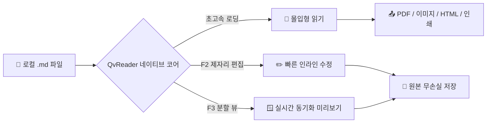

# QvReader에 오신 것을 환영합니다 - 초경량 마크다운 뷰어 & 편집기

**QvReader**에 오신 것을 환영합니다 —— 빠른 문서 열람과 몰입형 읽기, 가벼운 편집을 위해 설계된 네이티브 데스크톱 마크다운 도구입니다. 실행 시간 `<50ms>`, 극히 낮은 메모리 사용량으로 **더블 클릭 즉시 열기, 읽고 바로 닫기, 100% 로컬 작동, 개인정보 추적 제로**를 실현합니다.

> [!TIP]
> **빠른 팁**: 본문 영역 아무 곳이나 마우스 우클릭하면 전체 컨텍스트 메뉴가 열립니다. Mermaid 다이어그램을 더블 클릭하면 전체 화면 확대 모달로 자세히 볼 수 있습니다.

---

## 주요 단축키 안내

| 기능 | macOS 단축키 | Windows / Linux | 설명 |
| :--- | :--- | :--- | :--- |
| **순수 읽기 모드** | `Cmd + 1` | `Ctrl + 1` | 모든 사이드바를 숨기고 방해 없이 읽기에 집중 |
| **제자리 바로 편집** | `F2` | `F2` | 읽던 위치 그대로 본문 인라인 수정 |
| **동기화 분할 뷰** | `F3` | `F3` | 좌측 원본 코드, 우측 실시간 동기화 미리보기 |
| **문서 저장** | `Cmd + S` | `Ctrl + S` | 줄바꿈(CRLF/LF)과 문자 인코딩을 그대로 보존하여 저장 |
| **목차 아웃라인** | `Cmd + Shift + O` | `Ctrl + Shift + O` | 문서 목차 서랍을 열고 원하는 제목으로 빠르게 이동 |
| **기본 인쇄** | `Cmd + P` | `Ctrl + P` | 시스템 인쇄 대화상자 실행 (평생 무료) |
| **PDF로 내보내기** | `Cmd + Shift + P` | `Ctrl + Shift + P` | 벡터 다이어그램과 수식을 완벽히 보존한 고품질 PDF 출력 |
| **고화질 이미지 내보내기** | `Cmd + Shift + E` | `Ctrl + Shift + E` | 전체 문서를 2x Retina PNG로 캡처하여 클립보드에 복사 |
| **독립 HTML 내보내기** | `Cmd + Shift + H` | `Ctrl + Shift + H` | 스타일이 내장된 독립 실행형 오프라인 HTML 파일 생성 |
| **환경설정 센터** | `Cmd + ,` | `Ctrl + ,` | 테마 전환, 폰트 크기 확대/축소, 단축키 가이드 |
| **빠른 창 닫기** | `Esc` | `Esc` | 저장되지 않은 변경사항이 없으면 즉시 종료 |

---

## GFM 체크리스트 및 주요 기능

- [x] **50ms 미만 초고속 실행**: 무거운 로딩 없이 클릭 즉시 시작
- [x] **마크다운 원본 보존**: 원본 파일의 줄바꿈과 인코딩(UTF-8/EUC-KR)을 훼손하지 않음
- [x] **엔지니어링 다이어그램**: Mermaid.js 기본 내장 (순서도, 시퀀스 다이어그램, 상태 다이어그램)
- [x] **LaTeX 수학 수식**: KaTeX 엔진 기반 고성능 수식 렌더링
- [x] **100% 로컬 우선**: 외부 네트워크 전송 및 개인정보 추적 제로
- [ ] **`F2` 또는 `F3` 누르기**: 제자리 편집이나 분할 뷰를 지금 바로 체험해 보세요

---

## 아키텍처 및 다이어그램 (Mermaid)

QvReader는 Mermaid 문법을 기본 지원합니다. **다이어그램을 더블 클릭**하면 줌 컨트롤(`+`, `-`, 100% 리셋)이 제공되는 확대 모달이 열립니다:



---

## 수학 수식 (KaTeX)

인라인 수식 예시: 질량-에너지 등가원리 $E = mc^2$, 오일러 공식 $e^{i\pi} + 1 = 0$.

가우스 적분 및 이산 푸리에 변환 (DFT):

$$
\int_{-\infty}^{\infty} e^{-x^2} dx = \sqrt{\pi}
$$

$$
X_k = \sum_{n=0}^{N-1} x_n \cdot e^{-i 2\pi k n / N}, \quad k = 0, \dots, N-1
$$

---

## 코드 하이라이팅

```rust
// Rust 고속 파일 읽기 예제
use std::fs;
use std::path::Path;

pub fn read_markdown_fast(path: &Path) -> Result<String, std::io::Error> {
    fs::read_to_string(path)
}
```

---

## 알림 상자 (Callout Alerts)

> [!NOTE]
> **로컬 우선 원칙**: 사용자의 모든 문서는 사용자의 기기에만 안전하게 저장됩니다. 외부 클라우드로 업로드되거나 동기화되지 않습니다.

> [!IMPORTANT]
> **미저장 작업 보호**: 저장되지 않은 내용이 있을 때 창을 닫으면 안전 확인창이 열려 작업 손실을 철저히 방지합니다.

**QvReader**와 함께 쾌적하고 조용한 마크다운 읽기와 글쓰기를 즐겨보세요!
