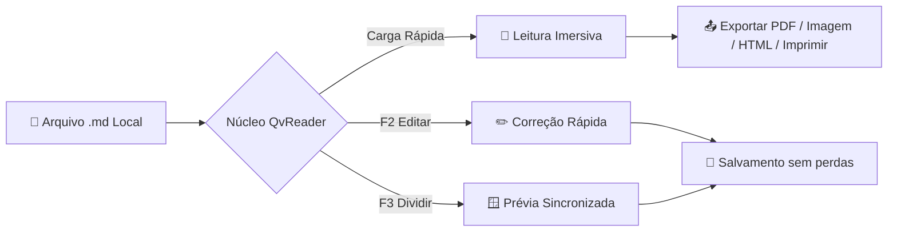

# Bem-vindo ao QvReader - Leitor e Editor Markdown Ultraleve

Bem-vindo ao **QvReader** —— o visualizador e editor de Markdown desktop nativo, leve e livre de distrações. Inicialização em `<50ms>` com consumo mínimo de memória: **clique duplo para abrir, ler e fechar instantaneamente, 100% local, zero rastreamento de privacidade**.

> [!TIP]
> **Dica Rápida**: Clique com o botão direito em qualquer área de leitura para abrir o menu de contexto completo; dê um clique duplo em qualquer diagrama Mermaid para inspecioná-lo em tela cheia com zoom.

---

## Principais Atalhos de Teclado

| Ação | Atalho macOS | Windows / Linux | Descrição |
| :--- | :--- | :--- | :--- |
| **Modo Leitura Pura** | `Cmd + 1` | `Ctrl + 1` | Oculta barras laterais para leitura sem distrações |
| **Edição no Local** | `F2` | `F2` | Edita o texto diretamente onde você está lendo |
| **Divisão Sincronizada** | `F3` | `F3` | Código-fonte à esquerda, pré-visualização ao vivo à direita |
| **Salvar Documento** | `Cmd + S` | `Ctrl + S` | Salva preservando quebras de linha e codificação original |
| **Sumário / Índice** | `Cmd + Shift + O` | `Ctrl + Shift + O` | Abre a gaveta de tópicos para navegar rapidamente |
| **Imprimir Documento** | `Cmd + P` | `Ctrl + P` | Abre diálogo de impressão do sistema (Grátis para sempre) |
| **Exportar como PDF** | `Cmd + Shift + P` | `Ctrl + Shift + P` | Exportação profissional mantendo diagramas e fórmulas |
| **Exportar como Imagem** | `Cmd + Shift + E` | `Ctrl + Shift + E` | Renderiza em 2x Retina PNG e copia para a área de transferência |
| **Exportar como HTML** | `Cmd + Shift + H` | `Ctrl + Shift + H` | Gera arquivo HTML autônomo com estilos embutidos |
| **Centro de Preferências** | `Cmd + ,` | `Ctrl + ,` | Troca de temas, tamanho de fonte e guia de atalhos |
| **Saída Instantânea** | `Esc` | `Esc` | Fecha a janela rapidamente se não houver alterações pendentes |

---

## Lista de Verificação GFM e Recursos

- [x] **Inicialização em <50ms**: Abertura instantânea sem telas pesadas de carregamento
- [x] **Fidelidade Markdown**: Preserva quebras de linha (CRLF/LF) e codificações (UTF-8/ISO)
- [x] **Diagramas de Engenharia**: Suporte nativo a Mermaid.js (fluxogramas, sequências e estados)
- [x] **Fórmulas Matemáticas LaTeX**: Motor KaTeX para equações elegantes
- [x] **100% Local e Privado**: Sem servidores externos nem rastreamento oculto
- [ ] **Experimente pressionar `F2` ou `F3`**: Comece a editar ou ver em tela dividida agora mesmo

---

## Arquitetura e Diagramas (Mermaid)

O QvReader suporta nativamente a sintaxe Mermaid. **Dê um clique duplo em qualquer diagrama** para abrir o modal de inspeção com zoom:



---

## Fórmulas Matemáticas (KaTeX)

Equivalência massa-energia $E = mc^2$, identidade de Euler $e^{i\pi} + 1 = 0$.

Integral gaussiana e transformada discreta de Fourier (DFT):

$$
\int_{-\infty}^{\infty} e^{-x^2} dx = \sqrt{\pi}
$$

$$
X_k = \sum_{n=0}^{N-1} x_n \cdot e^{-i 2\pi k n / N}, \quad k = 0, \dots, N-1
$$

---

## Destaque de Sintaxe

```rust
// Leitura rápida nativa em Rust
use std::fs;
use std::path::Path;

pub fn read_markdown_fast(path: &Path) -> Result<String, std::io::Error> {
    fs::read_to_string(path)
}
```

---

## Avisos e Citações

> [!NOTE]
> **Privacidade Total**: Todos os seus documentos ficam exclusivamente no seu dispositivo. O QvReader nunca envia seus arquivos para a nuvem.

> [!IMPORTANT]
> **Proteção de Edição**: Se você fechar a janela com alterações não salvas, um diálogo de confirmação protegerá seu trabalho.

Aproveite uma leitura e escrita fluida com o **QvReader**!
