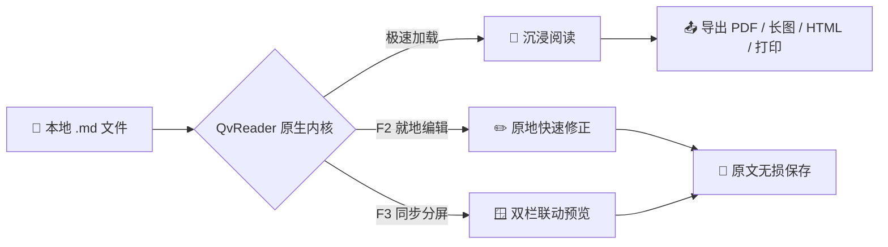
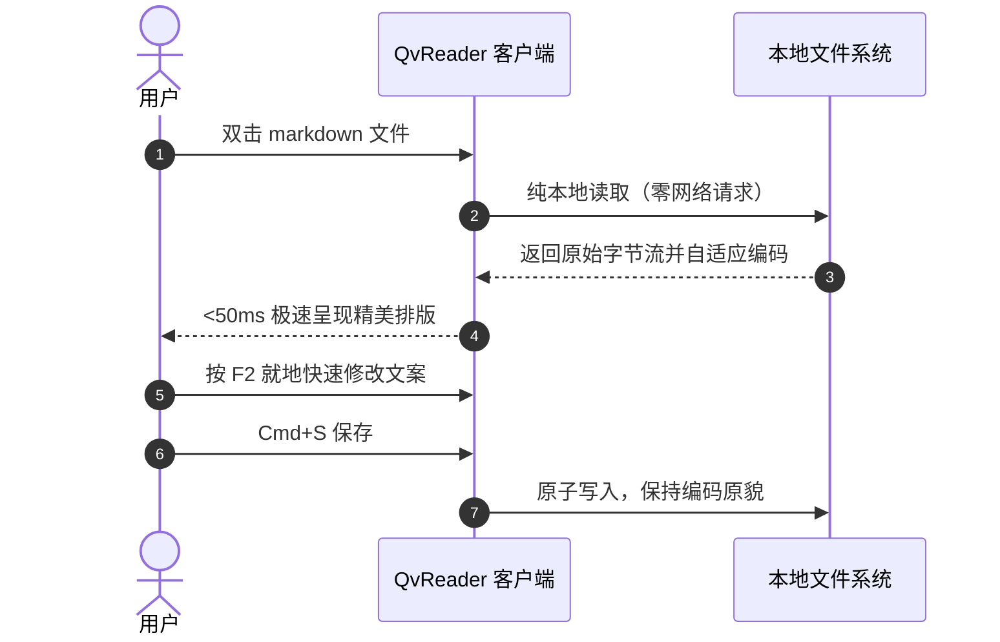

# 欢迎使用 QvReader 极简 Markdown 阅读与编辑器

欢迎体验 **QvReader** —— 专为极速阅读、无感查看与沉浸式写作打造的原生级轻量 Markdown 工具。启动时间 `<50ms`，内存占用极低，真正做到 **双击即开、读完即走、纯粹本地、零隐私追踪**。

> [!TIP]
> **快捷技巧**：在阅读区域任意位置点击鼠标右键，可呼出全功能快捷上下文菜单；双击页面中的 Mermaid 架构图表可开启全屏无损放大缩放检查。

---

## 常用快捷键一览

| 功能操作 | macOS 快捷键 | Windows / Linux | 说明 |
| :--- | :--- | :--- | :--- |
| **纯粹阅读模式** | `Cmd + 1` | `Ctrl + 1` | 隐藏所有边栏与工具栏，沉浸式阅读 |
| **就地实时编辑** | `F2` | `F2` | 在当前阅读位置直接原地修改文字 |
| **双栏同步分屏** | `F3` | `F3` | 左侧源码编辑，右侧同步高亮联动预览 |
| **保存当前文档** | `Cmd + S` | `Ctrl + S` | 原格式保存，严格保留换行符与文件编码 |
| **展开文档大纲** | `Cmd + Shift + O` | `Ctrl + Shift + O` | 快速查看文档目录树并平滑跳转各级标题 |
| **基础系统打印** | `Cmd + P` | `Ctrl + P` | 调起系统打印，分页排版自动优化（永久免费） |
| **导出为 PDF** | `Cmd + Shift + P` | `Ctrl + Shift + P` | 专业 PDF 导出，完整保留矢量图表与公式排版 |
| **导出高清长图** | `Cmd + Shift + E` | `Ctrl + Shift + E` | 渲染为 2x Retina PNG 并自动复制到剪贴板 |
| **导出独立 HTML** | `Cmd + Shift + H` | `Ctrl + Shift + H` | 生成内嵌排版样式的单文件离线网页 |
| **偏好设置中心** | `Cmd + ,` | `Ctrl + ,` | 主题外观切换、字体缩放、快捷键速查 |
| **极速退出窗口** | `Esc` | `Esc` | 快速关闭，无未保存变动时无感秒退 |

---

## GFM 任务清单与状态

- [x] **极速冷启动**：<50ms 闪电打开，告别大型重型编辑器漫长加载
- [x] **Markdown 保真性**：绝不篡改源文件的换行符（CRLF/LF）与字符编码（UTF-8/GBK/Shift-JIS）
- [x] **工程级图表支持**：原生集成 Mermaid.js，支持流程图、时序图、类图与状态机
- [x] **LaTeX 数学公式**：KaTeX 引擎亚毫秒级排版，支持复杂行内与块级公式
- [x] **纯本地离线优先**：100% 本地运算，绝无云端上传与后台遥测
- [ ] **试试按 `F2` 或 `F3`**：开始就地编辑或分屏体验

---

## 架构与工程图表 (Mermaid)

QvReader 原生支持 Mermaid 图表语法。**双击下方任意图表**即可弹出独立的缩放模态框，支持 `+` / `-` 缩放、重置 100% 与高清检查：



时序交互流程图示例：



---

## 数学公式排版 (KaTeX)

支持优雅的 LaTeX 数学表达式。

行内公式示例：质能方程 $E = mc^2$，欧拉恒等式 $e^{i\pi} + 1 = 0$，样本标准差 $\sigma = \sqrt{\frac{1}{N} \sum_{i=1}^N (x_i - \mu)^2}$。

高斯积分与傅里叶变换块级公式：

$$
\int_{-\infty}^{\infty} e^{-x^2} dx = \sqrt{\pi}
$$

$$
X_k = \sum_{n=0}^{N-1} x_n \cdot e^{-i 2\pi k n / N}, \quad k = 0, \dots, N-1
$$

多元正态分布概率密度函数：

$$
f(\mathbf{x}) = \frac{1}{(2\pi)^{k/2}|\boldsymbol{\Sigma}|^{1/2}} \exp\left( -\frac{1}{2}(\mathbf{x}-\boldsymbol{\mu})^T \boldsymbol{\Sigma}^{-1} (\mathbf{x}-\boldsymbol{\mu}) \right)
$$

---

## 代码高亮与多语言展示

代码块支持语法高亮与行号辅助展示：

```rust
// Rust 原生极速文件加载核心示例
use std::fs;
use std::path::Path;

pub fn read_markdown_fast(path: &Path) -> Result<String, std::io::Error> {
    // 零冗余开销，保留原生字节流保真性
    fs::read_to_string(path)
}
```

```typescript
// TypeScript 类型定义
export interface DocumentSession {
  filePath: string;
  isDirty: boolean;
  encoding: 'UTF-8' | 'GBK' | 'Shift-JIS';
  lineEnding: 'LF' | 'CRLF';
}
```

---

## 引用与警示框 (Callout Alerts)

> [!NOTE]
> **本地优先原则**：您的所有文档均完整保存在本地设备上。QvReader 绝不会扫描、上传或同步您的文档内容。

> [!IMPORTANT]
> **未保存安全防护**：编辑过程中若存在未保存内容，按 `Esc` 或关闭窗口时会弹出保存确认提示，绝不会丢失您的工作成果。

> 纸上得来终觉浅，绝知此事要躬行。  
> 祝您在 **QvReader** 享受流畅而宁静的阅读与写作时光！
